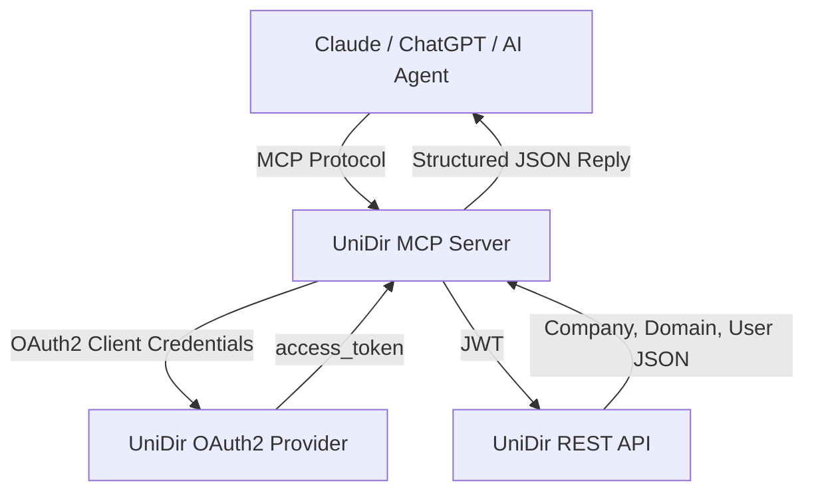

# 🧠 UniDir MCP (Model Context Protocol)

> **AI-Agent Gateway for the Universal Directory (UniDir) Platform**  
> A Model Context Protocol (MCP)-compatible service that connects your AI Agents to OAuth2-protected UniDir APIs — with built-in support for JWT authentication, token exchange, and multi-tenant data retrieval.

---

## 🚀 Overview

**UniDir MCP** acts as a bridge between the **Universal Directory (UniDir) OAuth2 Provider** and AI Agents (Claude, ChatGPT, or custom LLM-based systems).

It allows LLMs to:

- 🔑 Securely retrieve **OAuth2/JWT access tokens**
- 🧭 Fetch company, domain, user, or group data from the UniDir API
- 🔁 Use **token exchange** (`RFC 8693`) to access Google, Office 365, etc.
- 🧩 Integrate seamlessly with **Anthropic’s MCP standard** (Claude desktop, Node, or Express)
- 🌍 Run locally via WebSocket or expose as HTTP API for agents

---

## 🏗️ Architecture



---

## ⚙️ Features

| Category                  | Description                                                                                   |
| ------------------------- | --------------------------------------------------------------------------------------------- |
| 🧩 **MCP Tools**          | `get_access_token`, `force_refresh_token`, `fetch_unidir_data`, `fetch_unidir_user`, and more |
| 🔒 **OAuth2 Support**     | Uses `client_credentials` grant by default; supports `token_exchange` (RFC 8693)              |
| 🧠 **Multi-Tenant**       | Handles `companyId`, `domainId`, and `userId` isolation                                       |
| 💬 **AI Integration**     | Designed for Claude’s Model Context Protocol                                                  |
| 🌐 **Deployment Options** | Run locally via WebSocket, or deploy over HTTP for agents                                     |
| 🧱 **Extensible**         | Add new entity tools (e.g., `groups`, `permissions`, `apps`) easily                           |
| ⚡ **Async Ready**        | Built with async I/O for high concurrency                                                     |

---

## 🧩 MCP Tools

| Tool                                                                             | Description                                             |
| -------------------------------------------------------------------------------- | ------------------------------------------------------- |
| `get_access_token`                                                               | Retrieves a JWT token using client credentials          |
| `force_refresh_token`                                                            | Forces a new token, ignoring cache                      |
| `fetch_unidir_data_raw`                                                          | Fetches arbitrary JSON data from UniDir API             |
| `fetch_unidir_user`                                                              | Fetches user data for a specific company/domain/user    |
| `fetch_unidir_common`                                                            | Shared utility for entity fetches (users, groups, etc.) |
| `post_unidir_data`, `put_unidir_data`, `patch_unidir_data`, `delete_unidir_data` | API mutation tools for UniDir entities                  |

---

## 🧰 Installation

### 1️⃣ Clone the repository

```bash
git clone https://github.com/igoodworks/gw-unidir-mcp.git
cd gw-unidir-mcp
```

### 2️⃣ Setup environment

```bash
python -m venv .venv
source .venv/bin/activate   # Windows: .venv\Scripts\activate
pip install -r requirements.txt
```

### 3️⃣ Configure `.env`

```bash
UNIDIR_TOKEN_URL=http://localhost/oauth/v1/token
UNIDIR_API_BASE=http://localhost/api/v1
UNIDIR_CLIENT_ID=my-client-id
UNIDIR_CLIENT_SECRET=my-client-secret
```

---

## 🧩 Running the MCP Server

### Option 1 — Claude / ChatGPT (stdio mode)

```bash
python unidir_mcp/unidir_gateway_mcp.py
```

### Option 2 — WebSocket mode (for testing)

```bash
python unidir_mcp/unidir_gateway_mcp.py --mode ws --port 8080
```

### Option 3 — HTTP Server mode (for public MCP agents)

```bash
python unidir_mcp/unidir_gateway_mcp.py --mode http --port 8081
```

Example log:

```
[MCP] ✅ UniDir Gateway MCP running (JWT + Multi-Tenant)
[MCP] Tools: get_access_token, fetch_unidir_user, fetch_unidir_data
[MCP] 🌐 WebSocket MCP Server running on ws://0.0.0.0:8080
```

---

## 🤖 Example — Using MCP in Claude

After running the MCP server locally, open **Claude Desktop → Settings → Developer Mode**, then add:

```json
{
  "mcpServers": {
    "unidir-gateway": {
      "command": "python",
      "args": ["/path/to/unidir_gateway_mcp.py"],
      "env": { "PYTHONUNBUFFERED": "1" }
    }
  }
}
```

Now you can ask Claude:

> “Call the `fetch_unidir_user` tool with company_id='igoodworks', domain_id='igoodworks.com', user_id='james.chang'.”

---

## 🧩 Example — WebSocket Client (Node or Python)

```python
import asyncio, json, websockets

async def test():
    async with websockets.connect("ws://localhost:8080") as ws:
        await ws.send(json.dumps({"jsonrpc": "2.0", "id": 1, "method": "tools/list"}))
        print(await ws.recv())

asyncio.run(test())
```

---

## 🌍 Example — Token Exchange Flow

| Step | Description                                                                     |
| ---- | ------------------------------------------------------------------------------- |
| 1️⃣   | `get_access_token` from UniDir (`grant_type=client_credentials`)                |
| 2️⃣   | Use the JWT as `subject_token` in a `token_exchange` call                       |
| 3️⃣   | Receive new access tokens for Google / Office 365                               |
| 4️⃣   | Use secondary MCP tools (`fetch_calendar`, `fetch_email`) with exchanged tokens |

---

## 🧩 Integration Example

```python
result = await fetcher.fetch_unidir_data(
    endpoint="/companys/igoodworks/domainNames/igoodworks.com/users/james.chang",
    token=access_token
)
print(result)
```

---

## 🧠 Future Extensions

- 🔁 Support for `authorization_code` + login page
- 🗂️ Smart caching and memory replay for conversation context
- 🔐 PKCE-based OAuth2 flows
- 🧩 MCP Agent orchestration for federated API access
- 📡 Multi-protocol hosting (HTTP + WebSocket + SSE)

---

## 🧾 License

**MIT License**  
© 2025 [iGoodWorks Inc.](https://www.igoodworks.com)

---

## 💬 Contact

**Project:** UniDir (Universal Directory)  
**Organization:** iGoodWorks Communications
